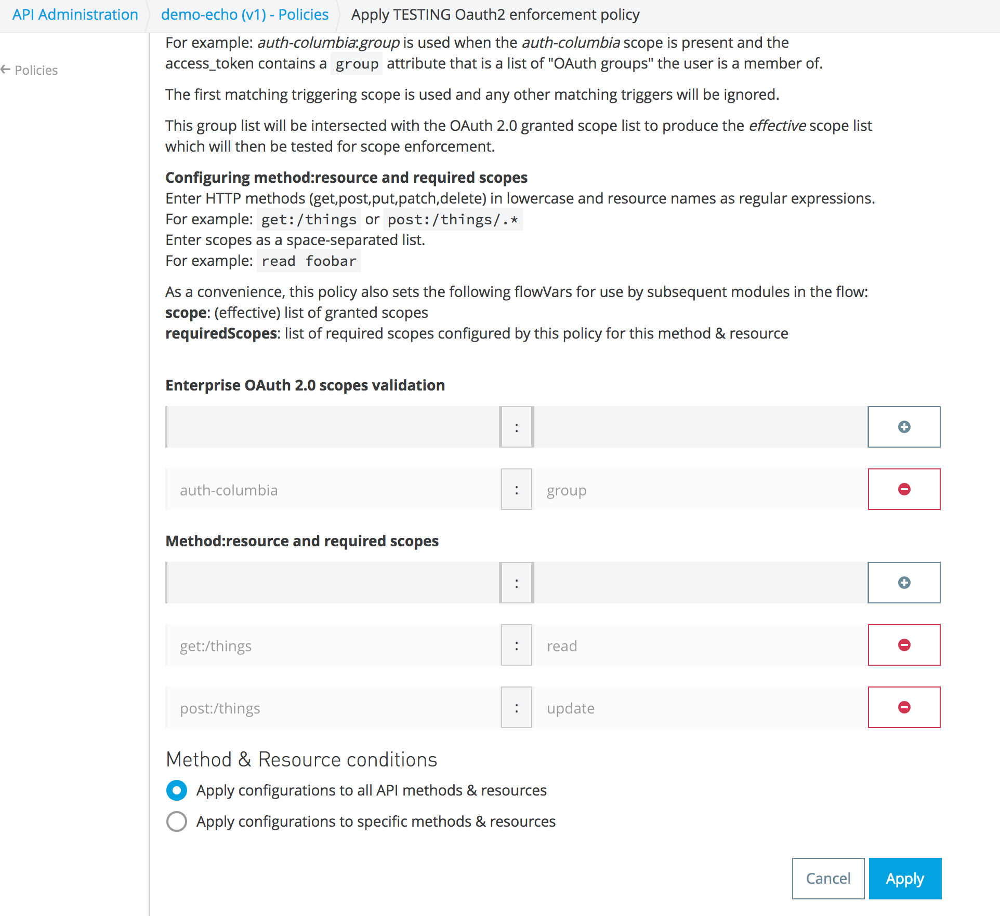
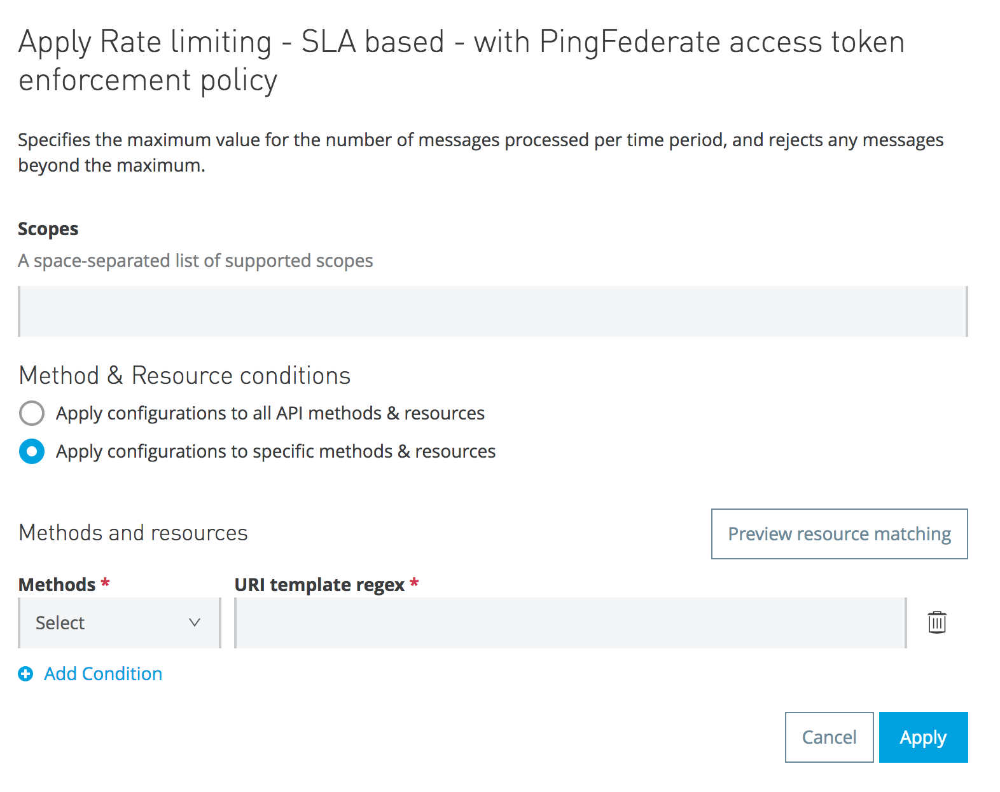
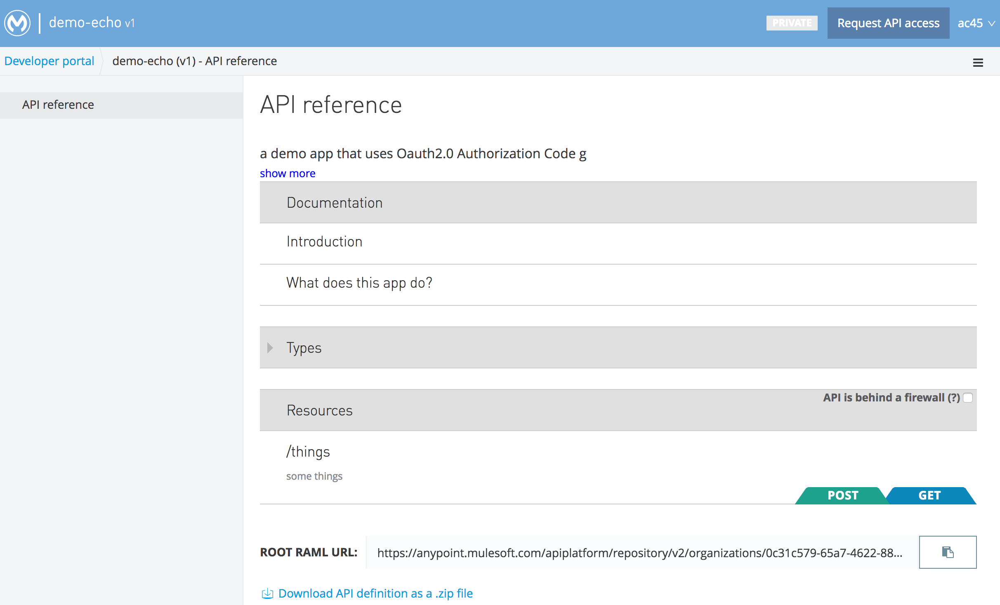

# mulesoft-oauth2-scope-enforcer
MuleSoft custom API gateway OAuth 2.0 scope enforcement policy

## Introduction
This Mulesoft API Gateway [custom policy](https://docs.mulesoft.com/api-manager/applying-custom-policies)
implements resource/method `securedBy` RAML scopes and optional "Enterprise" scope enforcement.
It is meant to be added after one of the OAuth 2.0
Access Token enforcement policies has already validated the Access Token and put the token information into
the `_agwTokenContext` flowVar.

## Installing the Policy

You must have API Manager privileges that allow you to install custom policies.
Follow the [Mulesoft instructions](https://docs.mulesoft.com/api-manager/add-custom-policy-task)
for adding custom policies, uploading the YAML and XML files.

## Applying the Policy

In API Manager for your app, select Policies/Apply New Policy and search for this custom policy. You
can narrow down the search by selecting Fulfills `OAuth 2.0 scope enforcement`.


Note that this policy requires an _upstream_ `OAuth 2.0 protected` policy to be installed first.

### Configuring Enterprise Scope Validation
Provide the triggering scope and group attribute name. The triggering scope causes enterprise validation for
the given attribute that is in the OAuth 2.0 validation result's access\_token (\_agwTokenContext).
For example: `auth-columbia`:`group` is used when the `auth-columbia` scope is present and the
access_token contains a `group` attribute that is a list of "OAuth groups" the user is a member of.

The first matching triggering scope is used and any other matching triggers will be ignored.

This group list will be intersected with the OAuth 2.0 granted scope list to produce the _effective_ scope list
which will then be tested for scope enforcement.

### Configuring Method:Resource Scope Enforcement
Configure the scope enforcement policy by adding method:resource keys and values that are the 
scopes you want to enforce for the given method:resource.
In this example, we add `get:/things` with `read` as the required scope and
`post:/things` with `create` scope.
The method:resource name is similar to what the MuleSoft APIkit router uses for flow names.

If you have a common (set of) scope(s) that you want enforced you can
repeat them here for each table entry, or list them in the prior `OAuth 2.0 protected` policy.




### flowVars added
As a convenience, this policy also sets the following flowVars for use by subsequent modules in the flow:

  **scope**: (effective) list of granted scopes

  **requiredScopes**: list of required scopes configured by this policy for this method & resource

## Why this custom policy is required

The reason this custom policy is needed is that the MuleSoft standard policies currently only 
implement _global_ checking for
a static list of required scopes rather than allowing for different required scopes for
each specific method and resource as shown here:



One must provide a single list of scopes and can optionally indicate which resource pattern(s) and
method(s) to apply that scope to. However, RAML (and OpenAPI/Swagger) is (are)
much more expressive and typically would use
_different_ scopes for various resources and methods in an API:

```
#%RAML 1.0
title: demo
version: v1
baseUri: https://demo.com/{version}
securitySchemes: 
  oauth_2_0: !include oauth2.raml

/things:
  get:
    securedBy:
      - oauth_2_0: { scopes: [ openid, auth-columbia, read ] }
  post:
    securedBy:
      - oauth_2_0: { scopes: [ openid, auth-columbia, create ] }
  /{id}:
	get:
	  securedBy:
		- oauth_2_0: { scopes: [ openid, auth-columbia, read ] }
	put:
	  securedBy:
		- oauth_2_0: { scopes: [ openid, auth-columbia, update ] }
```

In this example, GET /things requires the `read` scope and POST /things requires the `create` scope and
PUT /things/{id} requires the `update` scope.

## Policy Developer Notes
The following are notes for developers of this Policy.

The end game is to pass in a URL to the RAML description and then parse the RAML to find the securedBy
and cache this into a map Later, but consider that the `securedBy` is a list
of scopes that are _allowed_ and not necessarily _required_; there may be no way to identify which
ones to use; RAML is unclear about the semantics of OAuth 2.0 scopes.

To start, just use a mustache-templated keyvalues map of `{"method:resource": "scopes"}`.
See [oauth2-scope-enforcer.yaml](src/main/policy/oauth2-scope-enforcer.yaml) for an example
of specifying a keyvalues configuration property and
[oauth2-scope-enforcer.xml](src/main/policy/oauth2-scope-enforcer.xml) for an example
use of iterating over a map using `{{#map}} ... {{/map}}`.

The RAML can be found at `/console/api/?raml` if the APIkit console is enabled
or in the API Developer Portal (subject to permissions TBD):



Example inbound scoped properties for `PUT /v1/api/things/123` which belongs to the APIkit flow named
`put:/things/{id}:api-config`:

```
http.listener.path=/v1/api/*
http.method=PUT
http.query.params=ParameterMap{[]}
http.query.string=
http.relative.path=/api/things/123
http.remote.address=/127.0.0.1:51589
http.request.path=/v1/api/things/123
http.request.uri=/v1/api/things/123
http.scheme=https
http.uri.params=ParameterMap{[id=[123]]}
```

### Developing and Testing Mulesoft Custom Policies in Anypoint Studio
See https://docs.mulesoft.com/anypoint-studio/v/6/studio-policy-editor and
https://docs.mulesoft.com/api-manager/creating-a-policy-walkthrough

However, it seems when testing a custom policy in Studio, other policies are no longer applied. This
breaks things as we need the flowVars created by the upstream `OAuth 2.0 protected` policy.

Since it's hard to debug Python Code in the MuleSoft Jython world, use [test.py](./test.py) as a simple test harness:
Copy the configured Python code from the relevant XML file in `~/AnypointStudio/workspace/.mule/policies/` and
append it to test.py.

### Inconsistency across Mule implementations of OAuth 2.0

MuleSoft has three documented implementations of OAuth 2.0 token validation and there are inconsistencies
with how the result of a successful validation is made available to the downstream API app:

- The [external OAuth 2.0 token validation policy](https://docs.mulesoft.com/api-manager/external-oauth-2.0-token-validation-policy#obtaining-user-credentials)
  identifies the user as `_muleEvent.session.securityContext.authentication.principal.username` and suggests putting this in an X-Authenticated-Userid header
- The [OpenAM OAuth Token Enforcement policy](https://docs.mulesoft.com/api-manager/openam-oauth-token-enforcement-policy#obtaining-user-credentials)
  identifies the user as one of the following inboundProperties (HTTP headers) or flow variables:
  - `X-AGW-userid` user ID for authorization code grant type
  - `X-AGW-client_id` client ID
  - `flowVars[_agwUser]` HashMap which includes uid, group and email keys.
- The [PingFederate OAuth Token Enforcement policy](https://docs.mulesoft.com/api-manager/pingfederate-oauth-token-enforcement-policy#obtaining-user-credentials)
  similarly to OpenAM uses the same values.

**Additional observed, but undocumented, flowVars:**

[The deprecated API Gateway 2.0.2 release notes](https://docs.mulesoft.com/release-notes/api-gateway-2.0.2-release-notes) documents `flowVars[_agwTokenContext]` 
which on inspection is a String containing the returned JSON map. This flowVar is critical as it contains
the granted _scope_ list, among other things.

I've also seen these flowVars:
- `_client_id` ID of the registered client app
- `_client_name` name of the registered client app

So, I conclude that the “standard” is what’s used for OpenAM and PingFederate. If you are using some other
OAuth 2.0 token validation policy, this custom policy **will break** if \_agwTokenContext is not present.


### CAVEATS
- **Consider this an Alpha test experimental version!**

### TODO
- Test scopeMap keys syntax (must be verb:resource, verb is one of get,put,etc.
- Caching of method:url decision for performance

## Author
Alan Crosswell

Copyright (c) 2017 The Trustees of Columbia University in the City of New York

## LICENSE

Licensed under the [Apache License, Version 2.0](LICENSE) (the "License"); you may not use this file
except in compliance with the License. You may obtain a copy of the License at

http://www.apache.org/licenses/LICENSE-2.0

Unless required by applicable law or agreed to in writing, software
distributed under the License is distributed on an "AS IS" BASIS,
WITHOUT WARRANTIES OR CONDITIONS OF ANY KIND, either express or
implied. See the License for the specific language governing
permissions and limitations under the License.


